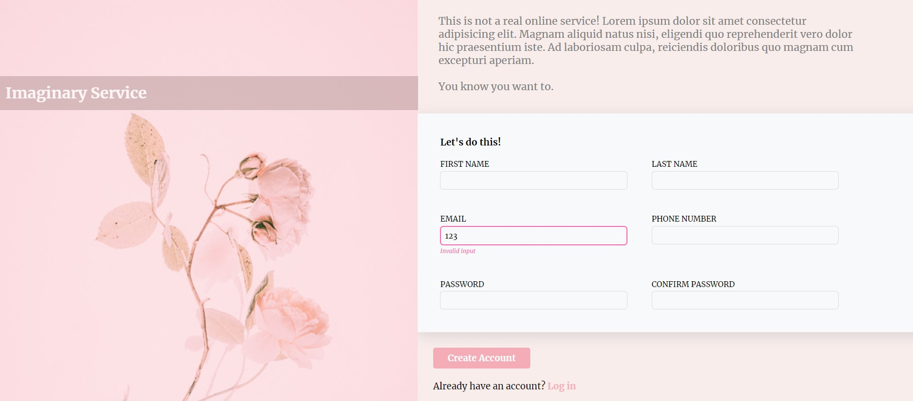

# Introduction
The objective is to create a sign-up form for the Imaginary Service that can perform input validation using only pure CSS and HTML. 
This project includes these features:
* basic input validation without JavaScript
* image overlay
* hover effects

[Live Demo👉](http://bravoosonja/sign-up-form)


# Skills used
- HTML
- CSS
# Lessons learned
* CSS position
* CSS pesudo-class 
* Validation using HTML
# Future plans
- [ ] **CSS** - Differentiate the error message for different inputs. For example, if passwords do not match, display "Passwords do not match"
- [ ] **HTML** - Include different forms of input validation such as pattern and mimum length.
```
<input type="password" id="psw" minlength="8" pattern="^(?=.*\d)(?=.*[a-z])(?=.*[A-Z])(?!.*\s).*$" 
title="Please include at least 1 uppercase character, 1 lowercase character, and 1 number." required>
```
 
      
